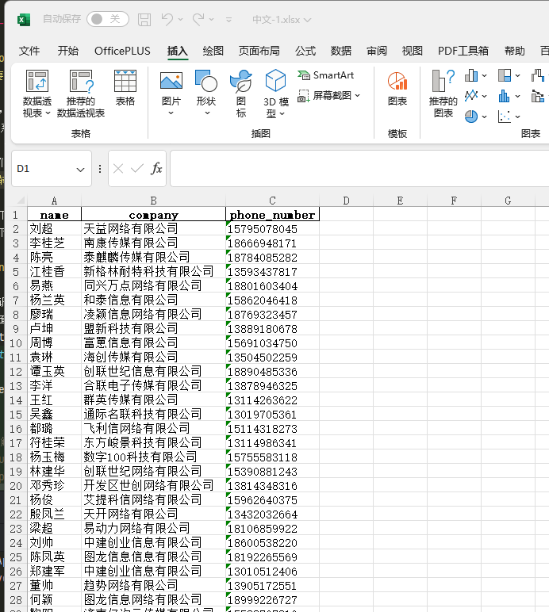

<p align="center" id='进群-banner-AI'>
    <a target="_blank" href='https://www.python4office.cn/wechat-group/'>
    
    </a>
</p>

<p align="center">
	👉 <a target="_blank" href="https://www.python-office.com/">Project Website: https://www.python-office.com/</a> 👈
</p>
<p align="center">
	👉 <a target="_blank" href="https://www.python4office.cn/wechat-group/">Open Source Project Discussion Group</a> 👈
</p>


<p align="center" name="atomgit">
  <a target="_blank" href='https://github.com/CoderWanFeng/python-office'>
    
    </a>
    	<a target="_blank" href='https://gitee.com/CoderWanFeng//python-office/'>
		
	</a>
	<a target="_blank" href='https://atomgit.com/CoderWanFeng1/python-office'>
		
	</a>
</p>
<p align="center" name="atomgit">
	<a href="https://mp.weixin.qq.com/s/8p2eviFUmYa1V0pswmDRmw">
  
</a>
    	<a href="https://www.python4office.cn/wechat-group/">
  
</a>

</p>

<!-- more -->


Main Content

-------------------------------------------------------------------------------

>Python Official released python-office, a library for Python automation: [Breaking! Official Released Third-Party Library: python-office, Built for Python Automation](https://mp.weixin.qq.com/s/v2n0DTVTZUaw7QOnA0Zlow)
>No need to write code yourself, just call the ready-made methods.

Hello everyone, this is CoderWanFeng, focusing on sharing: Python Automation.
**This series of tutorials introduces the features of python-office automation, one by one.**
## 1. Feature Introduction
Today we introduce one of the features of this library:
> **Excel Generate Mock Data**:
> - You can see the Excel screenshot below, containing names and corresponding companies and phone numbers. Doesn't it look real? But actually, all this data is mock data we generated.
> - With just one line of code, you can implement this cool feature.
> - 
## 2. Usage Instructions
#### Download python-office
Only one command is needed to automatically download and install python-office
```
pip install python-office
```
#### Call the Function
Copy the code below, modify the file location, right-click and select Run
```python
import office # Import python-office

office.excel.fake2excel(columns=['name', 'company', 'phone_number'],
                        rows=100,
                        path=r'./test_files/30-04-fake2excel/中文-1.xlsx')
# Parameter explanation:
# columns: Data to mock, each type is a column in Excel. Fill in the data names in [] with single quotes (see link below for available data types)
# rows: How many rows of data to generate
# path: Location and name of the generated Excel file
```
What data can be mocked? https://www.python4office.cn/python-office/fake2excel/

## 3. Submit Requirements
Is it simple to implement complex functions with just 1 line of code? The python-office automation library is still under continuous development.
Everyone is welcome to join the discussion group to share your feature requests~

Also welcome developers with technical skills to enrich this project together:
> - Your star & fork & pr are welcome! ⭐
> - Open Source Address:
> - https://gitee.com/CoderWanFeng/python-office
> - https://github.com/CoderWanFeng/python-office


CoderWanFeng focuses on AI programming training. Beginners can start making AI projects after watching his tutorial [《30 Lectures · AI Programming Training Camp》](https://mp.weixin.qq.com/s/8p2eviFUmYa1V0pswmDRmw) collaborated with Turing Community.
